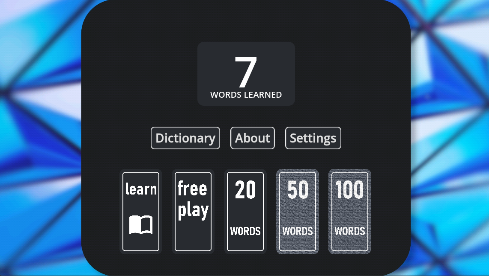
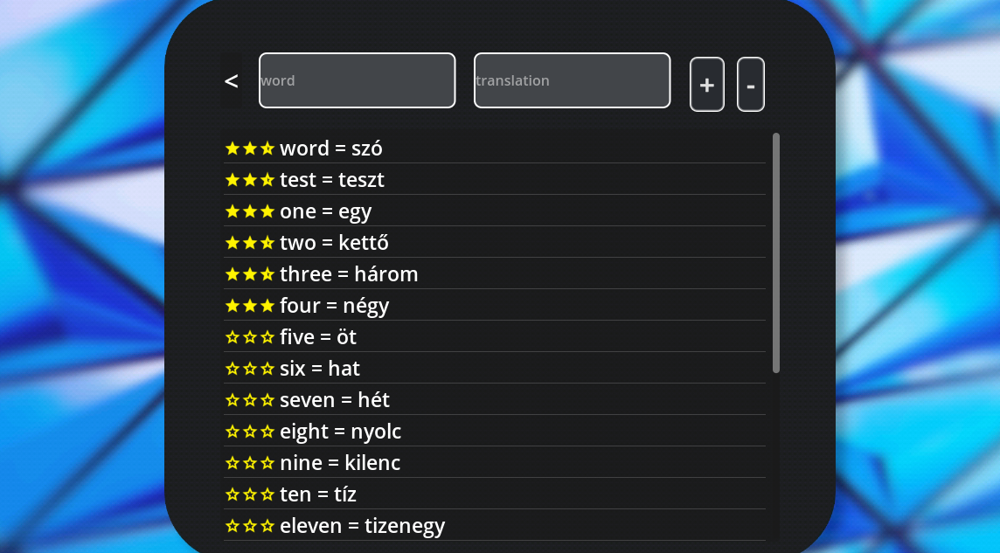

# flashcards by FrancisStudios 🎴

Flashcards are a proven method of learning vocabulary. Increase your success in learning a new language or definitions by writing them on flashcards, so you can continously test yourself. 

I wrote **flashcards** primarily for friends and for myself, but I decided to open up this project to the internet, so other people can benefit from this app. You can access the source code here, you can contribute to this project. Please read the [contribution page](./docs/contributing.md).

## Releases

- 🪟 Windows: [2.0.0 beta (unstable prerelease)](./Release/Windows/)
- 🐧 Linux: [no stable release yet]()
- 🍎 Mac: [no stable release yet]()

## Stack
This project was created in [GODOT Game Engine](https://godotengine.org/) - special thanks to this project.

## Application

When you open the application the first screen you see is the home screen where you can select a game mode or configure the application

### Home



#### Words learned

Number of words that has a success rate of the predefined treshold or more, and has been prompted at least a predefined time.

#### Game modes:

- **Learn**: no ranking and no timer. You can freely visit your flashcards without worrying about the timer or messing up the successrate of your words

- **Freeplay**: no ranking. Here, the timer is introduced, but the ranking is turned off, so you can test yourself against the timer and not worry about successrates.

- **Ranked**: You can choose to play **20**, **50** or **100** words in a timed manner, where you get a success rate for each word and you get a grade at the end in form of an emoji. Here you can test your skills, and spin up the **words learned** counter to show yourself how many new expressions you have mastered.

### Game

The game is simple! On the left you have a card which you have to translate. When the animation is finished and the timer starts - the input field on the bottom of the dialog is **enabled** and you can start typing. If the time is up, or you hit **enter** the answer is submitted and evaluated.


### Dictionary editor

In the dictionary editor you can add and remove words. If you fill the input fields and press the **button +** it will write your new word into the dictionary. And if you select a word and press the **button -** it will remove the selected line



In the dictionary editor you can see how successful you are in each word. The success rate is symbolised by stars. 

```py
	if success_rate > 90:
		return 3
	elif success_rate > 75:
		return 2.5
	elif success_rate > 60:
		return 2
	elif success_rate > 55:
		return 1.5
	elif success_rate > 50:
		return 1
	elif success_rate > 30:
		return 0.5
	elif success_rate < 30:
		return 0
```